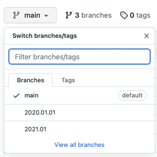

# PHASE/0インストール (2021.02)

## ご注意

講習会で利用する程度の基礎的な計算の動作は確認していますが、本格的な大規模計算や、高度な解析機能の全てが正常に動作することまでは確認していません。

あらかじめご了承ください。

## ダウンロード

[ダウンロードページ](https://azuma.nims.go.jp/cms1/downloads/software)から

- phase0_2021.02.tar.gz

を入手します。（無償ですが、登録が必要です）

ファイルを展開します。

```sh
tar zxf phase0_2021.02.tar.gz
cd phase0_2021.02
```

標準的なLinux環境など、一般的なインストール手順はユーザーマニュアルを参照してください。

## 個別環境

個別環境向けのインストール説明です。

- [Ubuntu20.04LTS (WSL)](./WSL/README.md)
- [FOCUS](./FOCUS/README.md)
- [SX-Aurora TSUBASA](./Aurora/README.md)
- [Mac (M1)](./Mac_M1/README.md)

## 旧バージョンの情報

旧バージョンの情報は、上部にあるブランチ選択メニュー（下図）から目的のバージョンを選択してご覧ください。


